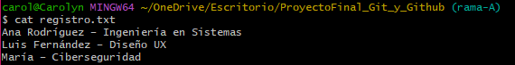

# Proyecto final

## Carolyn Acuña Monge

## Resumen completo de comandos Git utilizados

- `git add .` – Añade todos los archivos modificados al área de staging.
- `git commit -m "Mensaje del commit"` – Crea un commit con los cambios en staging.
- `git branch` – Lista todas las ramas locales del repositorio.
- `git branch nombre-de-rama` – Crea una nueva rama con el nombre indicado.
- `git checkout nombre-de-rama` – Cambia a la rama indicada.
- `git push -u origin nombre-de-rama` – Sube la rama al repositorio remoto y establece seguimiento.
- `git push origin nombre-de-rama` – Sube los cambios de la rama al repositorio remoto.
- `git push origin master` – Sube la rama master al repositorio remoto.
- `git pull origin master` – Trae y fusiona los cambios de la rama master remota.
- `git merge nombre-de-rama` – Combina los cambios de otra rama en la actual.
- `git merge --abort` – Cancela un merge en curso.
- `git checkout nombre-de-rama -- .` – Reemplaza los archivos de la rama actual con los de otra rama.

# Reflexión final

Trabajar con Git y GitHub es un proceso que combina organización, disciplina y atención al detalle. A lo largo de este proyecto, surgieron situaciones como conflictos de merge, cambios en varias ramas y la necesidad de sincronizar con el repositorio remoto. Estas experiencias muestran que no basta con conocer los comandos, sino que también es fundamental entender cómo y cuándo aplicarlos para mantener un historial limpio y un flujo de trabajo eficiente.

## Lecciones aprendidas

- Importancia de las ramas: Trabajar con ramas permite desarrollar funciones o corregir errores sin afectar la versión estable del proyecto. Mantener nombres claros y coherentes evita confusiones.
- Conflictos de merge: Los conflictos son inevitables cuando varias personas o ramas modifican los mismos archivos. Aprender a resolverlos con calma y precisión es esencial.
- Flujo de trabajo remoto: Entender cuándo hacer pull y push ayuda a mantener el repositorio sincronizado y evita sobrescribir cambios importantes.
- Staging y commits claros: Hacer commits frecuentes con mensajes descriptivos facilita el seguimiento de cambios y la colaboración.
- Revisión antes de merge: Siempre conviene revisar los cambios de otra rama antes de hacer merge, para evitar conflictos innecesarios o pérdida de información.

## Recomendaciones

- Mantén el repositorio organizado, con ramas bien nombradas y commits claros.
- Realiza pull antes de push para asegurarte de que tu copia local está actualizada.
- Usa git status y git log constantemente para entender el estado de tu repositorio.
- No tengas miedo de usar git merge --abort o git checkout -- . cuando necesites corregir errores sin comprometer todo.
- Documenta tu flujo de trabajo, de modo que cualquier persona (o tú mismo en el futuro) pueda entender rápidamente la historia del proyecto.